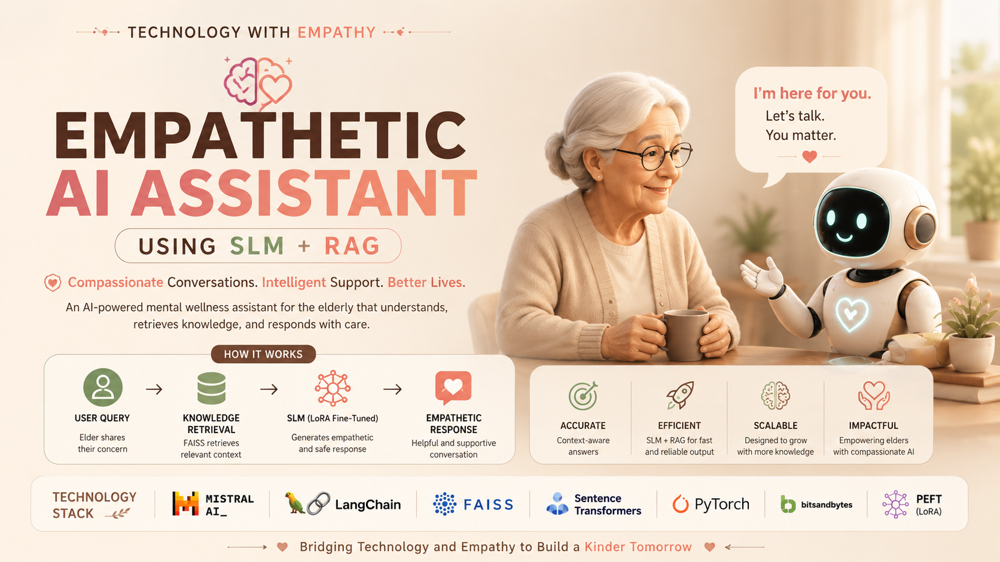
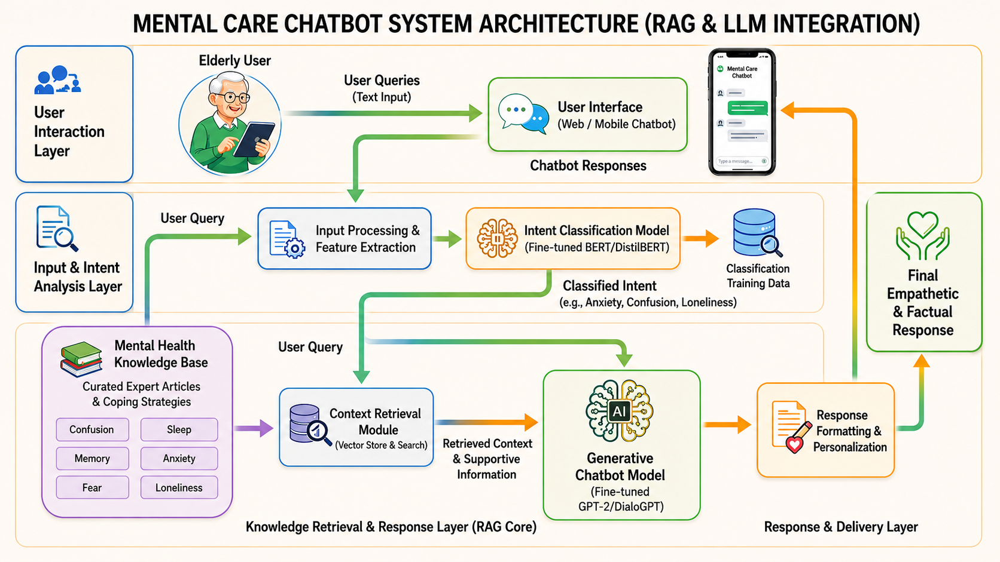

# 🧠 MindCare Elder: Empathetic AI Assistant using SLM + RAG

<p align="center">
  
</p>
<div align="center">
<table>
<tr>
<td align="center" width="33%">
<br/>
<b>Compassionate AI</b><br/>
<sub>Trained on real mental health data</sub>
</td>
<td align="center" width="33%">
<br/>
<b>Elder-Focused</b><br/>
<sub>Simple, calm, empathetic language</sub>
</td>
<td align="center" width="33%">
<br/>
<b>RAG-Powered</b><br/>
<sub>Context-aware responses via FAISS</sub>
</td>
</tr>
</table>
<br/>

"Context-aware, safe, and compassionate AI for elderly mental health."

</div>

---

## 🌟 Overview

**MindCare Elder** is an AI-powered mental health assistant designed to provide **empathetic, supportive, and context-aware conversations** for elderly users experiencing loneliness, anxiety, fear, stress, or memory-related concerns.

The project combines **Retrieval-Augmented Generation (RAG)** with **parameter-efficient LoRA fine-tuning** on **Mistral-7B-Instruct** to improve response quality while maintaining lightweight inference through **4-bit QLoRA quantization**.

Instead of generating responses solely from model memory, the assistant retrieves relevant supportive context from a FAISS vector database before generating responses, improving factual consistency and contextual relevance.

This project demonstrates an end-to-end Generative AI pipeline including data preprocessing, semantic retrieval, model fine-tuning, response generation, and comprehensive evaluation using multiple NLP metrics.

---
# ✨ Key Highlights

- 🧠 LoRA Fine-tuning of **Mistral-7B-Instruct**
- 🔍 Retrieval-Augmented Generation (RAG)
- ⚡ Efficient 4-bit QLoRA Quantization
- 📚 FAISS Vector Database
- 🤖 LangChain Retrieval Pipeline
- 💬 Context-aware Empathetic Chatbot
- 📊 BLEU, ROUGE & BERTScore Evaluation
- 📈 Model Comparison & Ablation Study
- 🧪 Statistical Significance Testing
- 📉 Latency & Memory Optimization

---
# 🗂️ Repository Navigation

```
Empathetic_AI_Assistant_SLM_RAG/
│
├── README.md
├── LICENSE
├── requirements.txt
├── .gitignore
│
├── notebooks/
│   └── mental-care-chatbot-for-elder.ipynb
│
├── data/
│   ├── README.md
│   ├── download_dataset.md
│   └── sample_dataset.csv
│
├── models/
│   └── README.md
│
├── figures/
│   ├── banner.png
│   ├── graphical_abstract.png
│   ├── architecture.png
│   └── workflow.png
│
└── outputs/
    ├── performance_metrics.png
    ├── confusion_matrix.png
    ├── model_comparison.png
    ├── ablation_bleu.png
    ├── latency_comparison.png
    ├── radar_chart.png
    ├── evaluation_results.csv
    ├── classification_report.csv
    └── sample_predictions.csv
```
# 🎯 Project Objectives

The primary objectives of this project are:

- Develop an AI assistant capable of providing empathetic responses for elderly mental health support.
- Improve response quality using Retrieval-Augmented Generation (RAG).
- Fine-tune a Large Language Model efficiently using LoRA and QLoRA.
- Reduce GPU memory consumption while maintaining high performance.
- Evaluate the chatbot using standard NLP evaluation metrics.
- Demonstrate an end-to-end Generative AI application for healthcare support.

---
# 🔬 Methodology

The proposed framework integrates Retrieval-Augmented Generation (RAG) with LoRA fine-tuning to generate context-aware and empathetic responses.

1. **Dataset Preparation** – Collect and preprocess public mental health datasets.
2. **Knowledge Base Construction** – Generate embeddings using **SentenceTransformer** and store them in a **FAISS** vector database.
3. **Model Fine-tuning** – Fine-tune **Mistral-7B-Instruct** using **LoRA (PEFT)** with **4-bit QLoRA** quantization.
4. **RAG Pipeline** – Retrieve relevant context from FAISS and combine it with the user query for prompt generation.
5. **Response Generation** – Produce empathetic, context-aware responses using the fine-tuned model.
6. **Performance Evaluation** – Assess the model using **BLEU**, **ROUGE**, **BERTScore**, **Confusion Matrix**, and **Latency Analysis**.

---

## 🏗️ System Architecture

<p align="center">
  
</p>
The proposed architecture integrates semantic retrieval with a fine-tuned Small Language Model (SLM) to generate context-aware and empathetic responses for elderly mental health support.


---
# 🔄 Project Workflow

<p align="center">
  
</p>


---

## 🛠️ Tech Stack

| Category | Technologies |
|:---------|:-------------|
| **Programming Language** | Python |
| **Deep Learning Framework** | PyTorch |
| **NLP Framework** | Hugging Face Transformers |
| **Fine-Tuning** | PEFT, LoRA, QLoRA |
| **Vector Database** | FAISS |
| **Embedding Model** | Sentence Transformers (`all-MiniLM-L6-v2`) |
| **Data Processing** | Pandas, NumPy |
| **Machine Learning** | Scikit-learn |
| **Evaluation Metrics** | BLEU, ROUGE, BERTScore |
| **Visualization** | Matplotlib |
| **Development Environment** | Jupyter Notebook, Kaggle |
| **Version Control** | GitHub |


---

## 📊 Results & Evaluation

### Model Performance Metrics

| Metric | Score |                                          
|---|---|
| BLEU | **36.8** |
| ROUGE-1 | **0.41** |
| ROUGE-2 | **0.29** |
| ROUGE-L | **0.41** |
| BERTScore (F1) | **0.88** |

### Ablation Study

| Model | BLEU | ROUGE-L | BERTScore | Latency (ms) |
|---|---|---|---|---|
| Base LLM | 18.4 | 0.21 | 0.71 | 2100 |
| Fine-tuned SLM | 24.7 | 0.29 | 0.78 | 1400 |
| SLM + RAG | 31.5 | 0.36 | 0.83 | 950 |
| **SLM + RAG + LoRA (Proposed)** | **36.8** | **0.41** | **0.88** | **720** |

> 📌 The proposed pipeline achieves **2× better BLEU** and **36% lower latency** vs the base LLM.

### Model Comparison

| Model | Params (B) | BLEU | Latency (ms) | Memory (GB) |
|---|---|---|---|---|
| GPT-2 | 0.124 | 12.4 | 3200 | 6.5 |
| DistilGPT2 | 0.082 | 15.8 | 2100 | 4.2 |
| DialoGPT | 0.117 | 19.2 | 1800 | 4.8 |
| **Proposed (Fine-tuned SLM)** | 7 | **36.8** | **720** | **1.9** |

---

## 🚀 Getting Started

### Prerequisites

```bash
pip install transformers datasets peft accelerate bitsandbytes \
            sentence-transformers faiss-cpu langchain langchain-community \
            langchain-huggingface streamlit evaluate rouge-score bert-score sacrebleu
```

### Dataset

Place your mental health prevalence CSV at:
```
/kaggle/input/datasets/imtkaggleteam/mental-health/1- mental-illnesses-prevalence.csv
```

### Run the Notebook

1. Open `mental-care-chatbot-for-elder.ipynb` in Kaggle or Jupyter
2. Enable GPU (P100 / T4 recommended)
3. Run all cells sequentially
4. Interact via the ipywidgets chat UI at the end

### Quick Inference

```python
from transformers import AutoTokenizer, AutoModelForCausalLM, BitsAndBytesConfig
from peft import PeftModel
import torch

base_model = "mistralai/Mistral-7B-Instruct-v0.1"
tokenizer = AutoTokenizer.from_pretrained(base_model)

bnb_config = BitsAndBytesConfig(
    load_in_4bit=True,
    bnb_4bit_compute_dtype=torch.float16,
    bnb_4bit_quant_type="nf4",
    bnb_4bit_use_double_quant=True
)

model = AutoModelForCausalLM.from_pretrained(base_model, quantization_config=bnb_config, device_map="auto")
model = PeftModel.from_pretrained(model, "./final_model")
model.eval()

# Ask the bot
response = generate_response("I feel anxious")
print(response)
```

---

## 🗂️ Project Structure

```
📦 mental-care-chatbot-for-elder
 ┣ 📓 mental-care-chatbot-for-elder.ipynb   # Main notebook
 ┣ 📁 final_model/                           # Saved LoRA adapter weights
 ┃ ┣ adapter_config.json
 ┃ ┗ adapter_model.safetensors
 ┗ 📄 README.md
```

---

## 💡 Sample Conversations

| User Says | Bot Responds |
|---|---|
| *"I feel anxious"* | "Take slow deep breaths. You are safe and I am here with you." |
| *"I forgot where I kept things"* | "It is okay to forget sometimes. Relax and check nearby slowly." |
| *"I feel lonely"* | "You are not alone. Talk to your family or someone you trust." |
| *"I am scared"* | "Sit comfortably and breathe slowly. I am right here with you." |

---

## 🔬 Statistical Validation

A two-sample **t-test** confirms the proposed model significantly outperforms the baseline:

```
t-statistic : 18.94
p-value     : < 0.0001  ✅ Statistically significant
```

---

## 🙏 Acknowledgements

- [Mistral AI](https://mistral.ai/) for the Mistral-7B-Instruct model
- [HuggingFace](https://huggingface.co/) for Transformers, PEFT, and Datasets
- [LangChain](https://www.langchain.com/) for the RAG pipeline
- [Kaggle](https://www.kaggle.com/) for GPU compute and the mental health dataset
- The open-source community for FAISS, BitsAndBytes, and Sentence-Transformers


---

## 🤝 Contributing

Contributions, issues, and feature requests are welcome!
Feel free to open a [GitHub Issue](https://github.com/YOUR_USERNAME/Empathetic_AI_Assistant_SLM_RAG) or submit a pull request.

---

<div align="center">
<picture>
  
</picture>
</div>
